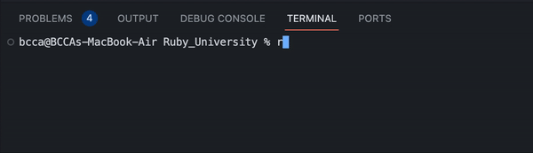

    
  
  # **Ruby University**

  ## **DESCRIPTION**
 This project represents a fake registration program that was created with Ruby. In this app, users engage with the program named 'Ruby Bot' to complete a mock registration process. 'Ruby Bot' determines if your eligibility for an interview based on your qualifications.

 ## **DEMO**

 

## **KEY FEATURES:**
1. **START**
    - The program will start by greeting the user and ask for their name.
    - It will then ask the user for their date of birth by year/month/day (E.X. 2024/02/16)
    - If the user is 18 or above, they are able to proceed with the program, otherwise, it will tell the user that they are too young and close the program.
2. **IMPORTANT VARIABLES**
    - `disappointment` - A number variable that starts off at 0 and will count up if the user does something that their not suppose to do. This determines if the user is accepted or not.
    - `work_experience` - A boolean variable that starts off as false and will become true if the user says that they have work experience. This is not required to be accepted.
    - `worthy` - A boolean variable that starts off as true and will become false if the user has too many disappointment points, or if they do not list any obstacle. This must be true for the user to be accepted for a interview.
3. **QUESTIONS**
    - First question: `"What are your achievements?"`. 
      - The user can list out all of their achievements that they have earned throughout their life.
      - If the user quits without adding an achievement, then they would have a little `disappointment` added to their counter.
    - Second question: `"Do you have any work experience?"`
      - If the user types `yes`, then the user will have to list out their work experience. If the user does not add their work experience after quitting then they would have a little `disappointment` added to their counter.
      - If the user types `no`, then they would proceed to the next question.
    - Third question: `"What are your skills?"`
      - The user can list out all of their skills that they have learned.
      - If the user quits without adding an skill, then they would have a little `disappointment` added to their counter.
    - Final question: `"What obstacles have you overcome?"`
      - The user can list out all of their obstacles that they overcome.
      - If the user quits without adding an obstacle, then they would have a little `disappointment` added to their counter and be deemed not `worthy`.
4. **RESULTS**
    - It will tell the user if they qualify for a interview with the university board or not.
    - It will then tell the user their score.
    - Then, it will list out all of the information that they provided.
5. **INSPIRATION**
    - My inspiration for this project was to make a small, real world application that I could make to test out my fresh skills of Ruby.

## **HOW TO USE (Visual Studio Code)**
1. Install [Ruby](https://www.ruby-lang.org/en/documentation/installation/) to your computer.
2. Download [Visual Studio Code](https://www.youtube.com/watch?v=HxJXKFxhah4)
3. Install the extensions "Ruby LSP" by Shopify and "VSCode rdbg Ruby Debugger" by Koichi Sasada.
4. clone this repo.
5. Open the project.
6. type `ruby path/to/filename.rb` through the terminal to run the project.

## **LICENSE**
N/A
